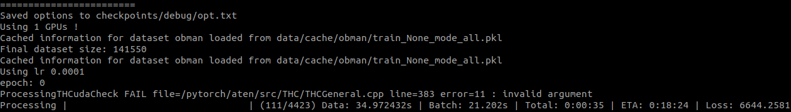
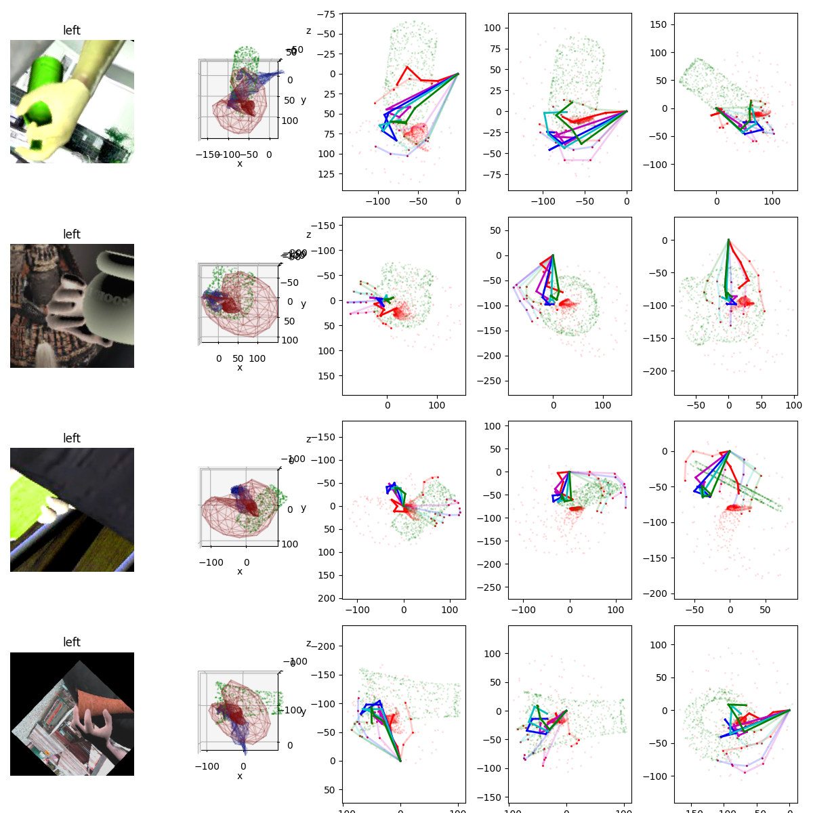
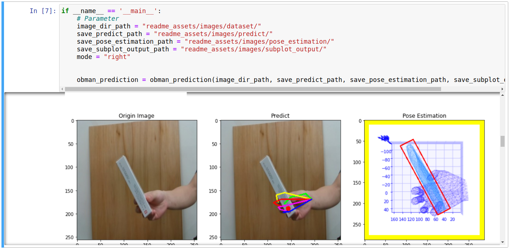
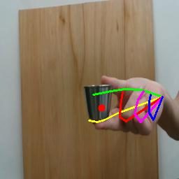
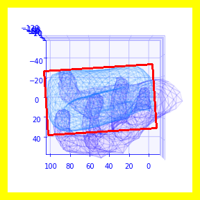
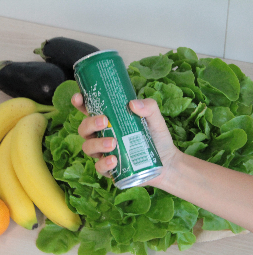
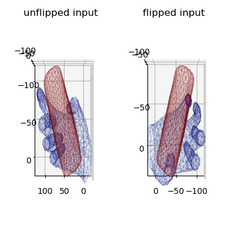
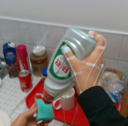
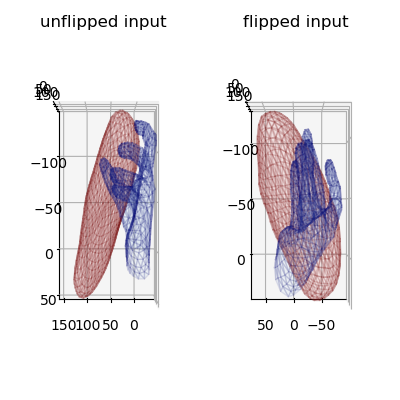
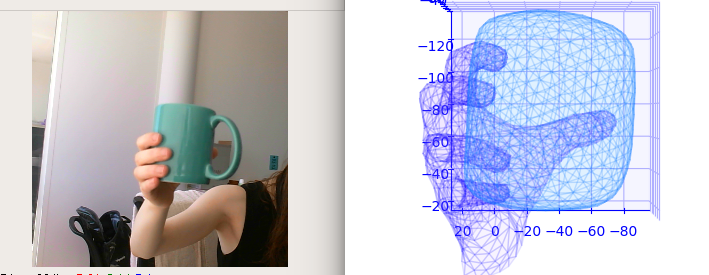

# Learning Joint Reconstruction of Hands and Manipulated Objects - Demo, Training Code and Models

Yana Hasson, Gül Varol, Dimitris Tzionas, Igor Kalevatykh, Michael J. Black,  Ivan Laptev, Cordelia Schmid, CVPR 2019

- [Project page](https://hassony2.github.io/obman)
- [Dataset repository](https://github.com/hassony2/obman)
- [Robotic grasps generation using MANO](https://github.com/ikalevatykh/mano_grasp)
- [Dataset generation](https://github.com/hassony2/obman_render)
- [Training](https://github.com/hassony2/obman_train)

# Get the code

```bash
$ git clone https://github.com/Alex1114/obman-hand-object-interaction.git
$ cd obman-hand-object-interaction
```   

# Training

```bash
$ source train_docker_run.sh
$ cd obman-hand-object-interaction
```  

## Download the ObMan dataset
  
```bash
$ source download_dataset.sh
```     
  
Your data structure should now look like

```
obman-hand-object-interaction/
  datasymlinks/ShapeNetCore.v2
  datasymlinks/obman
```
   
## Download the Model
  
```bash
$ source download_model.sh
```   
  
- Your structure should look like this:

```
obman_train/
  misc/
    mano/
      MANO_LEFT.pkl
      MANO_RIGHT.pkl
  release_models/
    fhb/
    obman/
    hands_only/

```  

## Start Training
Using Pytorch 1.1.0
```python3
$ sudo python3 traineval.py --atlas_predict_trans --atlas_predict_scale --atlas_mesh --mano_use_shape --mano_use_pca --freeze_batchnorm --atlas_separate_encoder
```
       



# Validation
```bash
$ jupyter notebook
```  
  
Run Jupyter notebook and open "validation.ipynb".





  
# Run on Real Robot
  
# Launch

## Demo
  
We provide a model trained on the synthetic ObMan dataset

### Single image demo

```python3
python3 image_demo.py --resume release_models/obman/checkpoint.pth.tar
```

In this demo, both the original and flipped inputs are fed, and the outputs are therefore presented for the input treated as a right and a left hand side by side.

Running the demo should produce the following outputs.




You can also run this demo on data from the [First Hand Action Benchmark](https://github.com/guiggh/hand_pose_action)

```python3
python3 image_demo.py --image_path readme_assets/images/fhb_liquid_soap.jpeg --resume release_models/fhb/checkpoint.pth.tar
```




Note that the model trained on First Hand Action Benchmark strongly overfits to this dataset, and therefore performs poorly on 'in the wild' images.

### Limitations

- This demo doesn't operate hand detection, so the model expects a roughly centered hand
- As we are deforming a sphere, the topology of the object is 0, which explains results such as the following:



- the model is trained only on hands holding objects, and therefore doesn't perform well on hands in the absence of objects for poses that do not resemble common grasp poses.
- the model is trained on grasping hands only, and therefore struggles with hand poses that are associated with object-handling
  - In addition to the models, we also provide a hand-only model trained on various hand datasets, including our ObMan dataset, that captures a wider variety of hand poses
  - to try it, launch 
    ```python3
    python webcam_demo.py --resume release_models/hands_only/checkpoint.pth.tar
    ```
  - Note that this model also regresses a translation and scale parameter that allows to overlay the predicted 2D joints on the images according to an orthographic projection model

# Citations

If you find this code useful for your research, consider citing:

```
@INPROCEEDINGS{hasson19_obman,
  title     = {Learning joint reconstruction of hands and manipulated objects},
  author    = {Hasson, Yana and Varol, G{\"u}l and Tzionas, Dimitris and Kalevatykh, Igor and Black, Michael J. and Laptev, Ivan and Schmid, Cordelia},
  booktitle = {CVPR},
  year      = {2019}
}
```

# Acknowledgements

## AtlasNet code

Code related to [AtlasNet](http://imagine.enpc.fr/~groueixt/atlasnet/) is in large part adapted from the official [AtlasNet repository](https://github.com/ThibaultGROUEIX/AtlasNet).
Thanks [Thibault](https://github.com/ThibaultGROUEIX/) for the provided code !

## Hand evaluation code

Code for computing hand evaluation metrics was reused from [hand3d](https://github.com/lmb-freiburg/hand3d), courtesy of [Christian Zimmermann](https://lmb.informatik.uni-freiburg.de/people/zimmermc/) with an easy-to-use interface!


## Laplacian regularization loss

[Code](https://github.com/akanazawa/cmr) for the laplacian regularization and precious advice was provided by [Angjoo Kanazawa](https://people.eecs.berkeley.edu/~kanazawa/) !


## First Hand Action Benchmark dataset

Helpful advice to work with the dataset was provided by [Guillermo Garcia-Hernando](https://guiggh.github.io/) !
